# eCommerce Frontend using React

This is the frontend of an eCommerce web application built using the MERN (MongoDB, Express, React, Node.js) stack.

## Usage

Follow these steps to get started:

1. Clone the repository:
   ```
   git clone [url]
   ```
2. Change Directory to frontend folder:
   ```
    cd  frontend
   ```
3. Install dependencies:
   ```
   npm i --force
   ```

3. Start the development server:
   ```
   npm start
   ```

## Screenshots

### Admin Dashboard

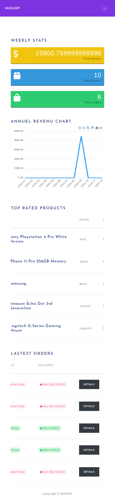

This is the admin dashboard where you can manage products, users, and orders.

### Add/Edit Product

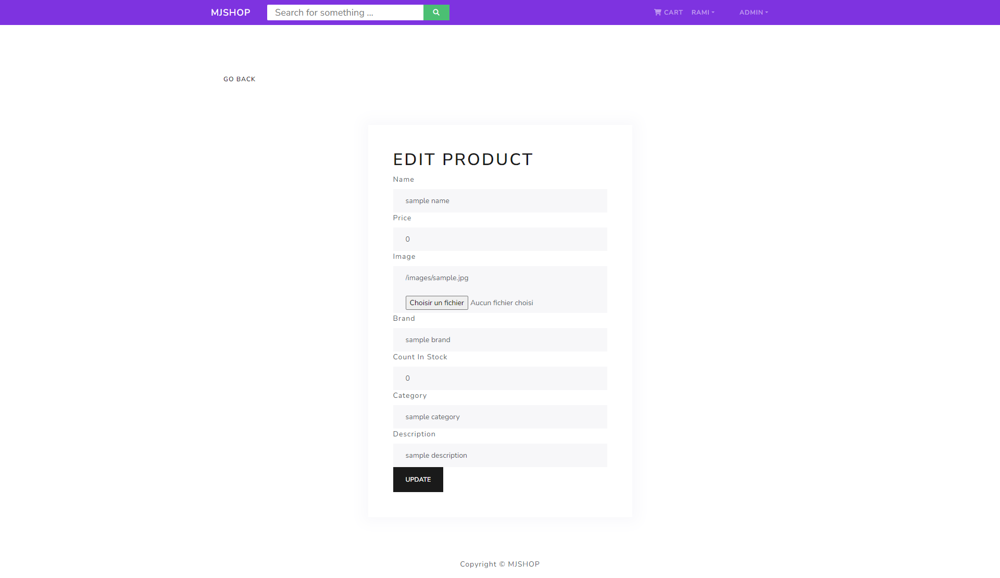

Here, you can add or edit product details, including name, description, price, and images.

### Product List

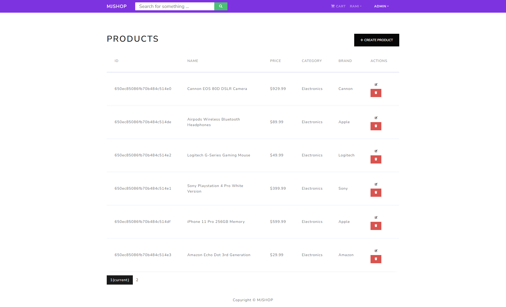

View a list of all available products and manage their details.

### User List

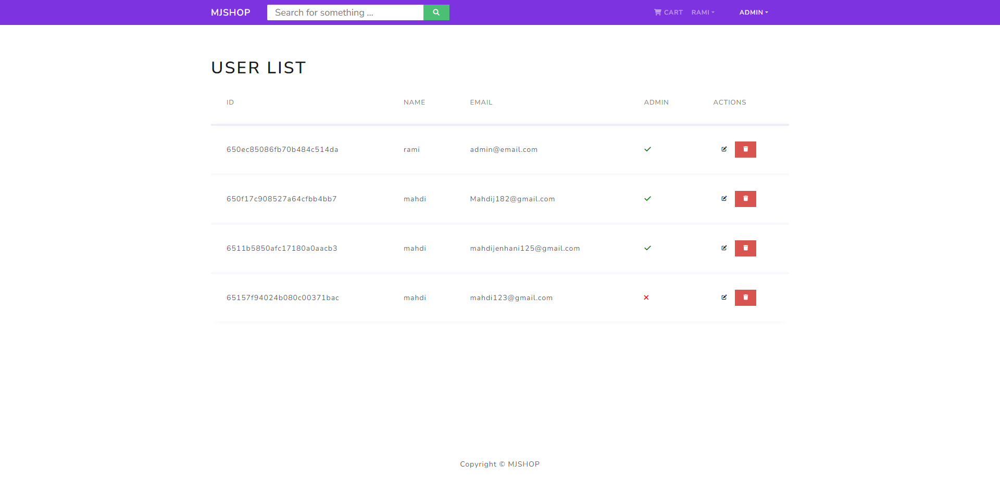

Manage user accounts and access their information.

### Cart Page

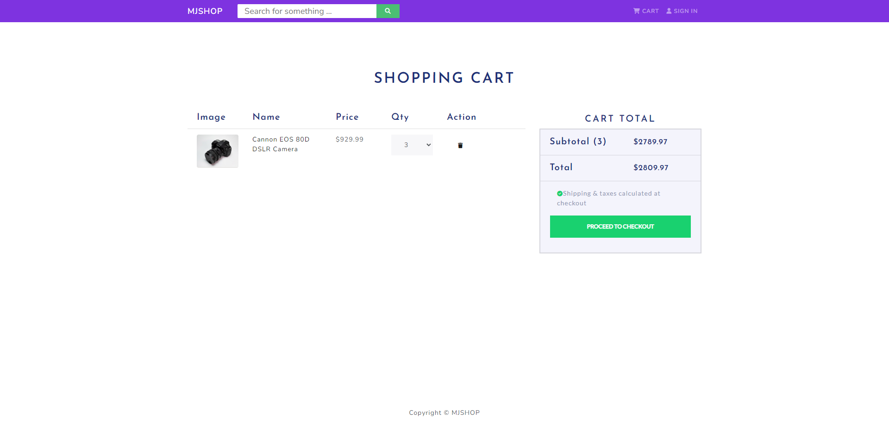

The cart page displays selected items and allows users to review and edit their cart.

### Home Page (Desktop)

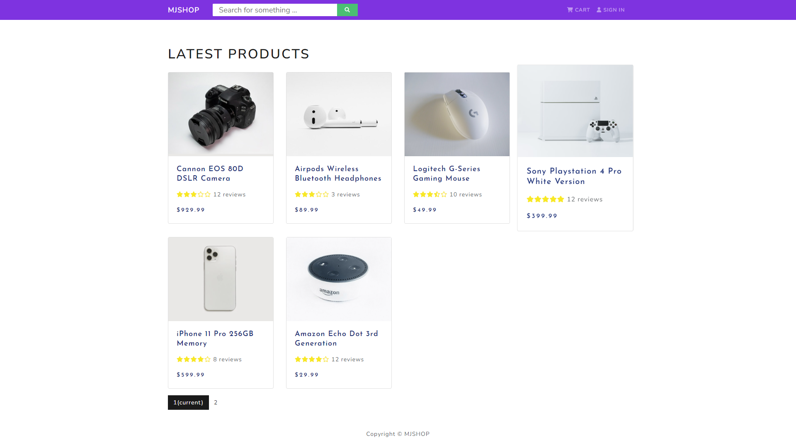

The desktop version of the home page showcases featured products and provides navigation to different sections.

### Home Page (Mobile)

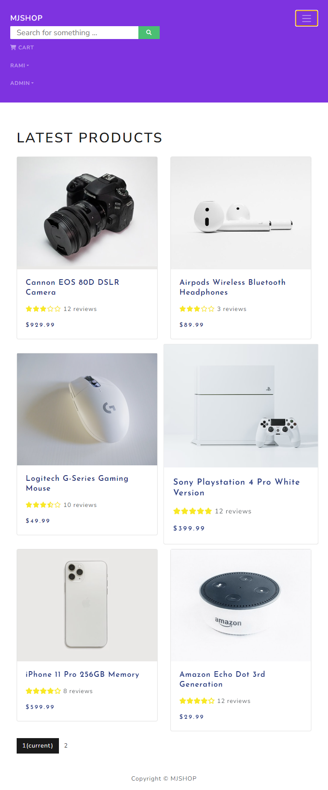

The mobile version of the home page offers a responsive layout for smaller screens.

### Login Page (Desktop)

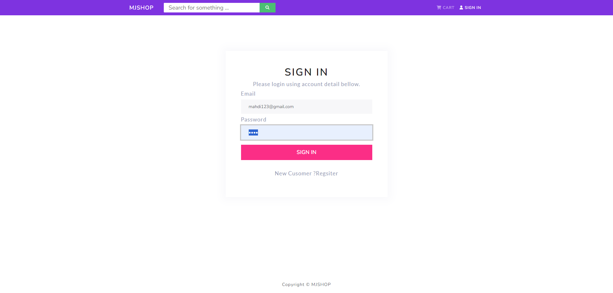

Users can log in using their credentials through this page.

### Register Page (Desktop)

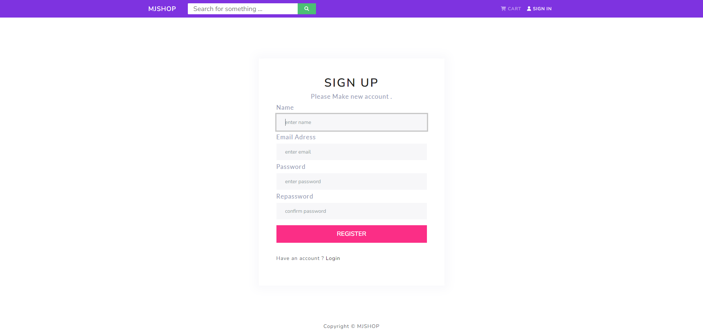

New users can create accounts by filling out the registration form.

### Product Details (Desktop)

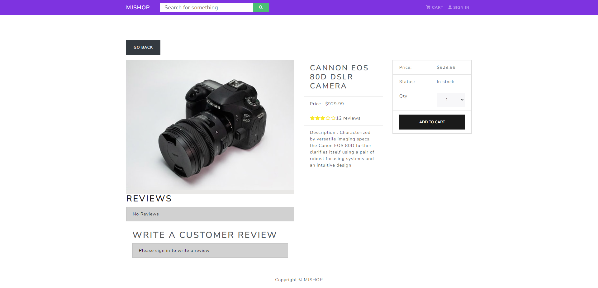

Detailed product information is displayed on this page, along with options for adding items to the cart.

### Product Details (Mobile)

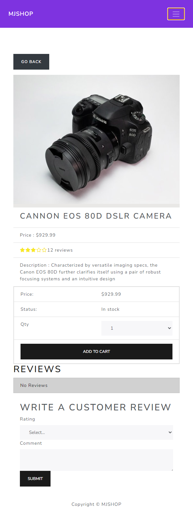

A mobile-friendly view of product details for on-the-go shopping.

### Place Order Page (Desktop)

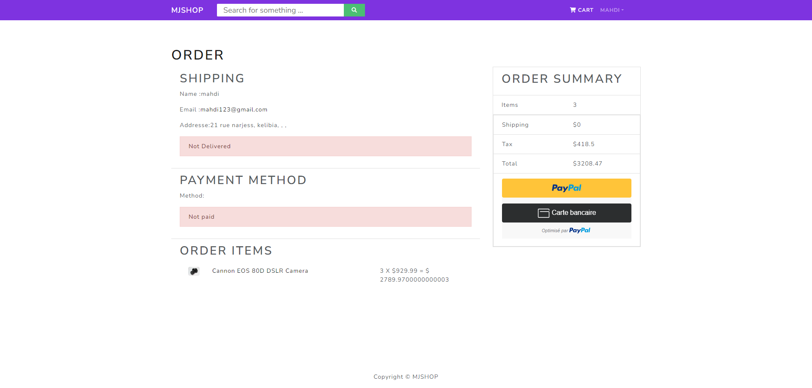

Customers can review their order and provide shipping information before completing the purchase.

### Shipping Info (Desktop)

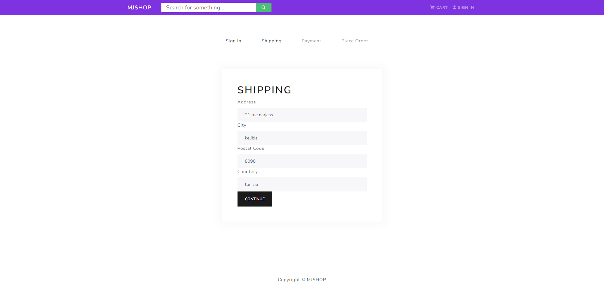

This page allows users to input their shipping address details.

### Profile Page (Desktop)

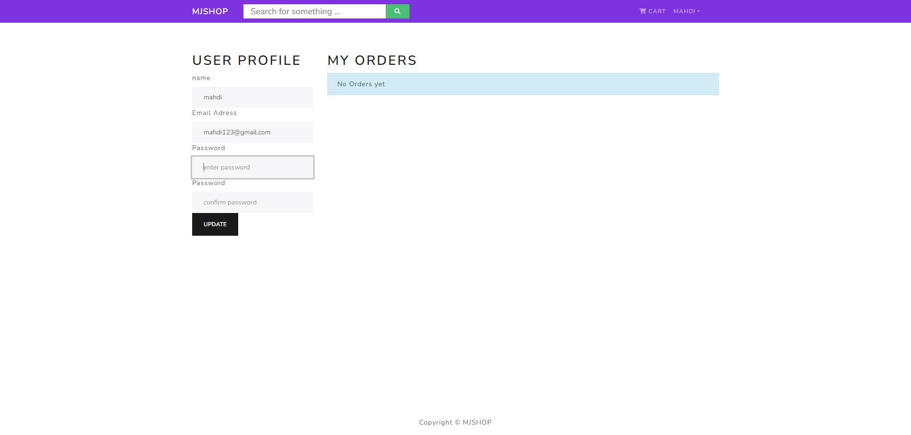

Registered users can manage their profiles and update personal information.

## Contributing

If you would like to contribute to this project, please open an issue or submit a pull request.

## License
